# SoundScapers

SoundScapers is a full-stack web application that allows users to create, manage, and share soundboards. Built with Django and Bootstrap, it provides a user-friendly interface for managing audio tracks.

Deployed Site :  (https://soundscapers-515cda02218b.herokuapp.com/)

<p align="right">(<a href="#readme-top">back to top</a>)</p>

## Table of Contents

- [About The Project](#about-the-project)
  - [Built With](#built-with)
- [Getting Started](#getting-started)
  - [Prerequisites](#prerequisites)
  - [Installation](#installation)
- [Usage](#usage)
- [Testing](#testing)
- [Roadmap](#roadmap)
- [Contributing](#contributing)
- [License](#license)
- [Contact](#contact)
- [Acknowledgments](#acknowledgments)

## About The Project


A soundscape is a sound or combination of sounds that forms or arises from an immersive environment. This application is a very simple audio editing system for creating loops that are just that, Soundscapes!

Once you have created a user account, you can start making noise from your home page by clicking the "Soundboard" button. You can add audio tracks to a mixer within your Soundboard ("workspace") and then save, update, and delete as you please. If you wish to load a soundboard, you can do so from the drop-down menu on the soundboard page or click view directly from the homepage!

Initially only had 5 static sounds to choose from , but with the scope to add many more features like : 

Custom user uploads
Bigger sound library
Live sampling/recording

Make changes, click save again, and voila! 
If you have made a sound you want to keep and share with your friends, set a duration in the mixer and click download to get your own WAV file straight to your device.

<p align="right">(<a href="#readme-top">back to top</a>)</p>

### Built With

* [Django](https://www.djangoproject.com/)
* [JavaScript](https://developer.mozilla.org/en-US/docs/Web/JavaScript)
* [Python](https://www.python.org/)
* [Tone.js](https://tonejs.github.io/)

<p align="right">(<a href="#readme-top">back to top</a>)</p>

## Getting Started

To get a local copy up and running, follow these steps.

### Prerequisites

- Python 3.x
- Node.js and npm

### Installation

1. Clone the repository:
   ```sh
   git clone https://github.com/your_username/soundscapers.git
   cd soundscapers
   
2. Install Python Dependencies:
    pip install -r requirements.txt

3. Install Node.js dependencies:
    npm install

4. Set up Environment variables:
    cp env.example.pu env.py

5. Run database migrations:
    python manage.py migrate

6. Start development server
    python manage,py runserver

<p align="right">(<a href="#readme-top">back to top</a>)</p>


## Usage

Sign Up: Create a new user account. You will be sent back to the homepage automatically after creaton.

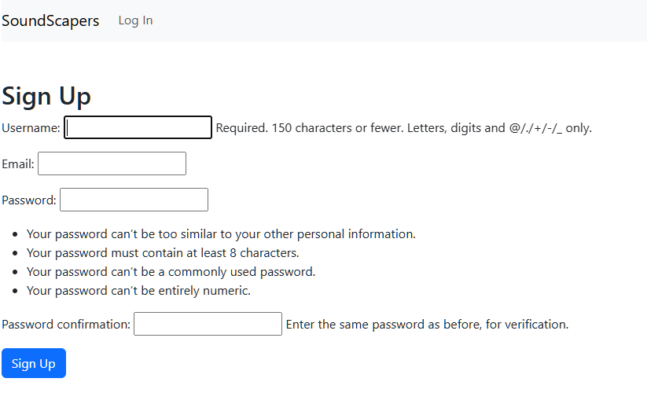

Log In: Access your account.

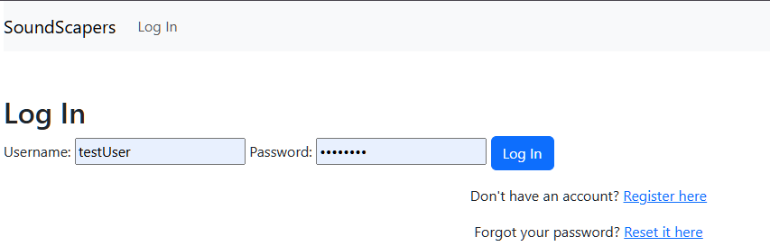

Home Area: View all your soundboards for easy loading. Clicking on a soundboard here will load it in the workspace.

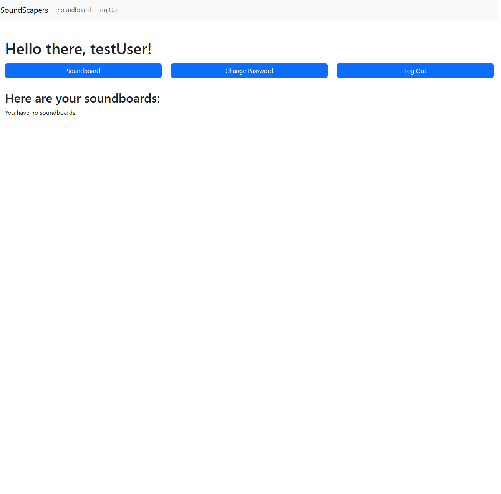
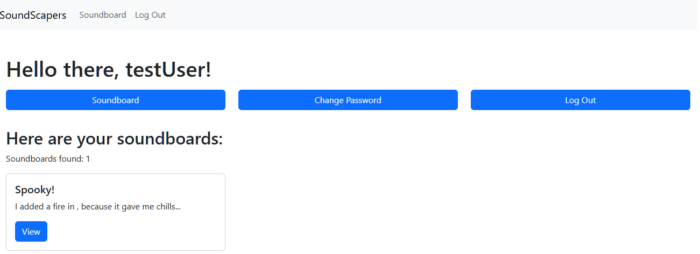

Clicking Soundboard on the button or navbar will take you to the Soundboard Area.
Soundboard Area: An empty workspace where you can select audio to add. Drag and drop on PC or tap to apply on touch devices.

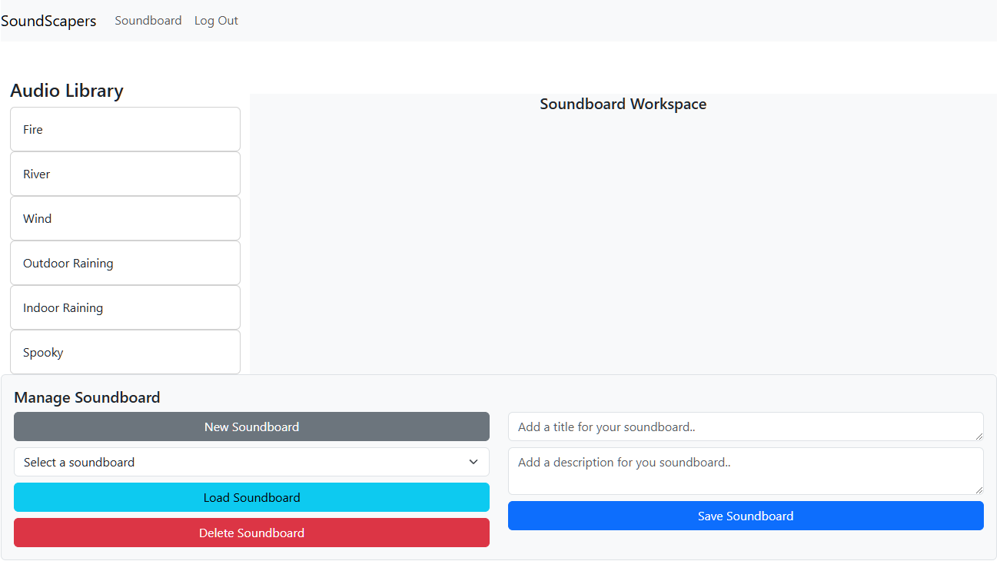


Mixer: Add tracks to the mixer, set a title and description, and save your soundboard. Load soundboards from the drop-down menu and clear the workspace to start fresh.
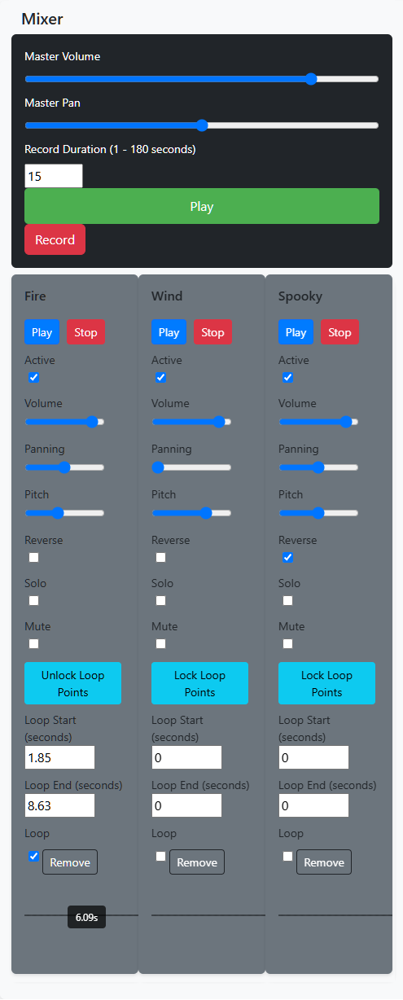

Manage Soundboard:  Use the manage soundboard section to clear the workspace , save ,load and delete mixers!
This is where you can also Set the title and description.
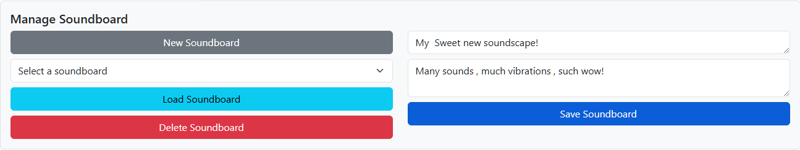

Track Options: Adjust volume, pan, loop settings, pitch, and more. Play, stop, solo, mute, and reverse tracks as needed.

Download: Set a duration and click download to get your WAV file. 
A bar will show the progress and then a wav file will be added to your downloads named recording.wav
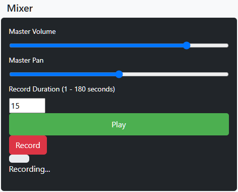


<p align="right">(<a href="#readme-top">back to top</a>)</p>

## Planning 

wire frames where used in ([balsamiq](https://www.balsamiq.com)) and ERD created with ([Lucid.app](https://www.lucid.app)).

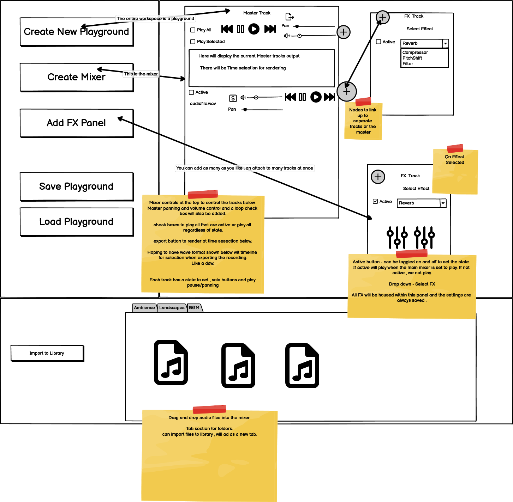

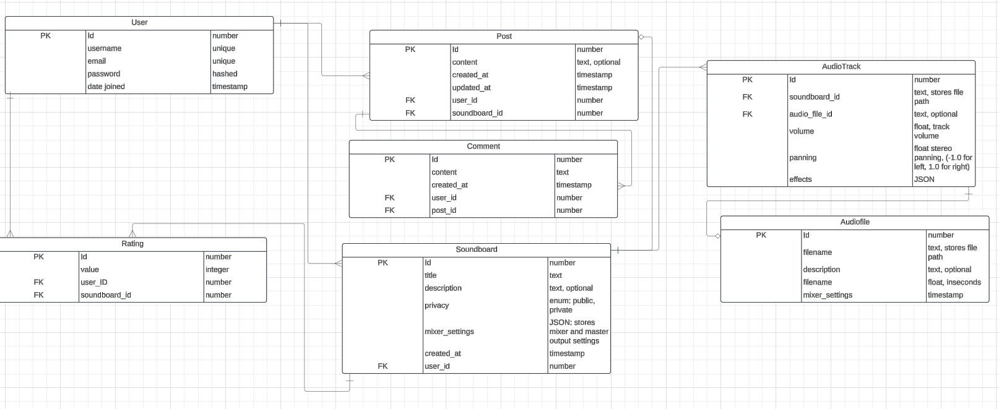

The soundboard was what took up most of the time creating in the 2 weeks we had, and it did end up quite suprisingly similair to how the end product came about. (End used loosely) 


I used an agile workflow to get the project through the motions. Setting small precise tasks following my project board and many amounts of stickynotes across the screen.
Following the MoSCow workflow really helped with keeping the application manageable. 

At first the scope was too large and had to re-arrange what waas needed for the mvp ( changed the concept of alot of the must haves , into could haves.)

Projectboard: ([Project Board](https://github.com/users/MarshallJD1/projects/11/views/1))

Alot of features had to be redacted or ommitted (Like the feed) and the scope changed to the given time frame. 

Feed capabilities and the ability to share eachothers boards , comment and rate will be added in the future.


<!--Testing-->
## Testing

I have tested the log in and register/signup on all devices and seems to be working seemelessly.

I had a problem with the soundboards not saving if multiple where made in one sessions . To fix this there is a page reload after a soundboard save.

Touch drag and drop functionality could not get working to mimic the mouse drag and drop - To fix this on tap the audio is selected and on tap in the workspace
it is added there.

Had some teething issues with testing the recovery email system. Was an oversight from not adding in heroku back end logic.

The same can be said about getting the login/sign in interaction witht he database working smoothly, all that had been missing was csrf tokens and setting up authentication logic .

There was am early styling issue with  adding the tracks to the mixer, sorted by using bootstrap classes.

Error wheen audio was attempted to be played when still loading , added in load buffer and signal to user - playing is also stopped until tracks loaded.

Tone.start not initiating on touch screens , added in touch event listener - oversight. 


I have used the w3c validator for html and css.
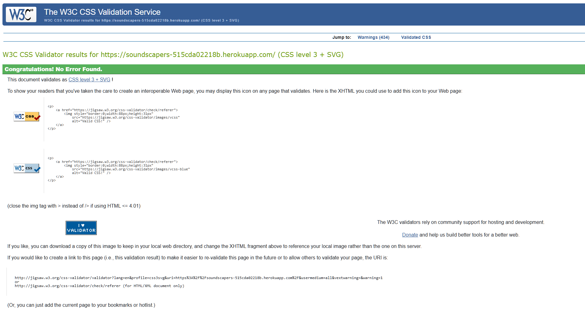
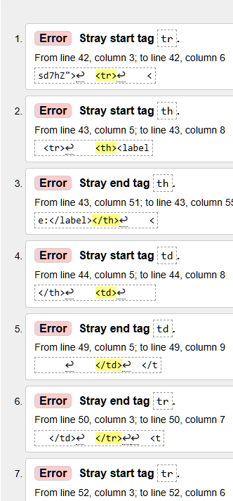 
These where fixed by altering the way django had generated a form , by overiding it with my own template.
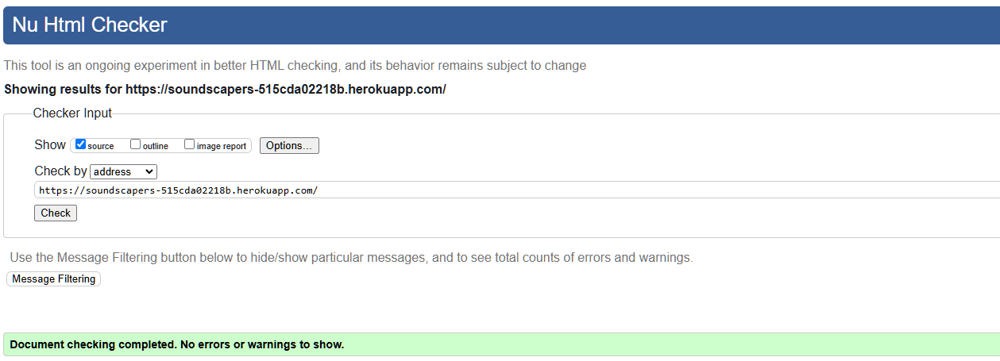

I have checked light house for perfromance and best practices etc. 
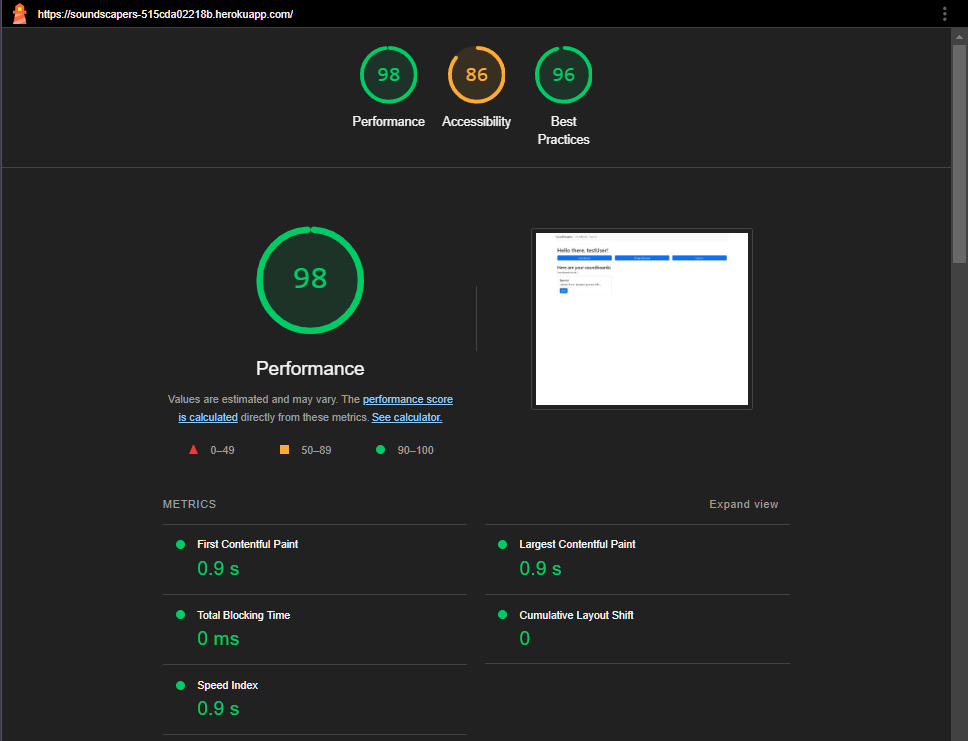


I found issues with missing html lang tags and the cdn usage which throw up un needed errors in validation.
I have also used ([accessibilitychecker.org](https://www.accessibilitychecker.org/))

<!-- ROADMAP -->
## Roadmap

- [v1.1] Ability to add own personal audio files into the workspace.
- [v1.2] Take live feed recordings, turn them into cards that can then be altered in the mixer.
- [v1.3] Add in a Feed that users can share, comment on and rate eachothers creations.
- [v1.4] Ability to copy soundboards from the feed into own workspace and alter.
    


<p align="right">(<a href="#readme-top">back to top</a>)</p>


<!-- CONTRIBUTING -->
## Contributing

Any Contributions to this project would be greatly appreciated, no matter how big or small! 
If you would like to add in a feature that you have been working on by all means follow the steps below and get coding!

1. Fork the Project
2. Create your Feature Branch (`git checkout -b feature/AmazingFeature`)
3. Commit your Changes (`git commit -m 'Add some AmazingFeature'`)
4. Push to the Branch (`git push origin feature/AmazingFeature`)
5. Open a Pull Request

<p align="right">(<a href="#readme-top">back to top</a>)</p>


<!-- LICENSE -->
## License

MIT License

Copyright (c) [2025] [James Marshall]

Permission is hereby granted, free of charge, to any person obtaining a copy
of this software and associated documentation files (the "Software"), to deal
in the Software without restriction, including without limitation the rights
to use, copy, modify, merge, publish, distribute, sublicense, and/or sell
copies of the Software, and to permit persons to whom the Software is
furnished to do so, subject to the following conditions:

The above copyright notice and this permission notice shall be included in all
copies or substantial portions of the Software.

THE SOFTWARE IS PROVIDED "AS IS", WITHOUT WARRANTY OF ANY KIND, EXPRESS OR
IMPLIED, INCLUDING BUT NOT LIMITED TO THE WARRANTIES OF MERCHANTABILITY,
FITNESS FOR A PARTICULAR PURPOSE AND NONINFRINGEMENT. IN NO EVENT SHALL THE
AUTHORS OR COPYRIGHT HOLDERS BE LIABLE FOR ANY CLAIM, DAMAGES OR OTHER
LIABILITY, WHETHER IN AN ACTION OF CONTRACT, TORT OR OTHERWISE, ARISING FROM,
OUT OF OR IN CONNECTION WITH THE SOFTWARE OR THE USE OR OTHER DEALINGS IN THE
SOFTWARE.

<p align="right">(<a href="#readme-top">back to top</a>)</p>


<!-- CONTACT -->
## Contact

James Marshall - MarshallJD1 - MarshallJD1@gmail.com

Project Link: [https://github.com/MarshallJD1/soundscapers](https://github.com/MarshallJD1/soundscapers)

<p align="right">(<a href="#readme-top">back to top</a>)</p>


<!-- ACKNOWLEDGMENTS -->
## Acknowledgments


* [Django](https://www.djangoproject.com/)
* [Bootstrap](https://getbootstrap.com/)
* [Tone.js](https://tonejs.github.io/)

<p align="right">(<a href="#readme-top">back to top</a>)</p>
```

## AI Usage Reflection

Throughout this project, I have used ChatGPT (primarily within VS Code) as a guidance tool. As I am working with new languages and frameworks, AI has been invaluable in helping me navigate these unfamiliar territories.

### How AI Was Used

- **Data Population for Testing**: AI assisted in generating sample data for testing purposes.
- **Problem-Solving**: AI was used to brainstorm solutions and provide explanations for complex syntax and code segments.
- **Documentation Assistance**: AI helped with understanding and utilizing documentation for Tone.js and Django.
- **Syntax Guidance**: AI provided guidance on correct syntax and best practices in languages that are relatively new to me.


### Observations on AI Usage

While AI has been a highly useful learning tool, it is important to note its limitations:
- **Context Awareness**: AI can sometimes miss the specific context of your code, add its own context, or omit key elements.
- **Precision in Requests**: When given broad or imprecise requests, AI may overlook important parts of the code. It is crucial to be specific and precise in your queries.
- **Scrutiny of Suggestions**: AI-generated code should be carefully reviewed and scrutinized. It is best used as a helper rather than a primary code writer.

### Conclusion

Using AI in this project has been beneficial for learning and problem-solving. However, it is essential to critically evaluate AI suggestions and use them as a supplementary tool rather than relying on them entirely.


<p align="right">(<a href="#readme-top">back to top</a>)</p>


